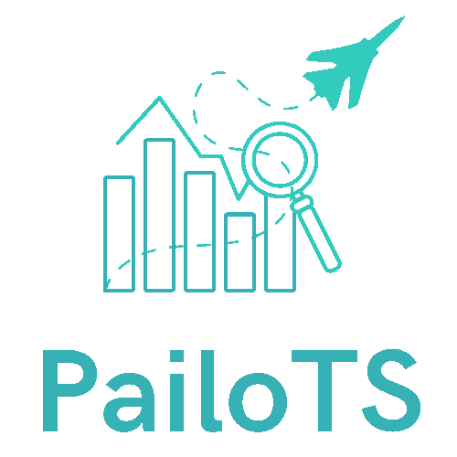

<a name="readme-top"></a>


[![Contributors][contributors-shield]][contributors-url]
[![Stargazers][stars-shield]][stars-url]
[![Issues][issues-shield]][issues-url]
[![LinkedIn][linkedin-shield]][linkedin-url]


<!-- PROJECT LOGO -->
<br />
<div align="center">
  <a href="https://github.com/Lynda-Starkus/PailoTS">
    
  </a>

  <h3 align="center">PailoTS : Predictive AI operations for time series</h3>

  <p align="center">
    Pythonic framework for predicting future failures in AIOps time series.
    <br />
    <a href="https://github.com/Lynda-Starkus/PailoTS"><strong>Explore the docs »</strong></a>
    <br />
    <br />
    <a href="https://github.com/Lynda-Starkus/PailoTS">View Demo</a>
    ·
    <a href="https://github.com/Lynda-Starkus/PailoTS/issues">Report Bug</a>
    ·
    <a href="https://github.com/Lynda-Starkus/PailoTS/issues">Request Feature</a>
  </p>
</div>


<!-- TABLE OF CONTENTS -->
<details>
  <summary>Table of Contents</summary>
  <ol>
    <li>
      <a href="#about-the-project">About The Project</a>
      <ul>
        <li><a href="#built-with">Built With</a></li>
      </ul>
    </li>
    <li>
      <a href="#getting-started">Getting Started</a>
      <ul>
        <li><a href="#prerequisites">Prerequisites</a></li>
        <li><a href="#installation">Installation</a></li>
      </ul>
    </li>
    <li><a href="#usage">Usage</a></li>
    <li><a href="#roadmap">Roadmap</a></li>
    <li><a href="#research">Research work</a></li>
    <li><a href="#contributing">Contributing</a></li>
    <li><a href="#license">License</a></li>
    <li><a href="#contact">Contact</a></li>
    <li><a href="#acknowledgments">Acknowledgments</a></li>
  </ol>
</details>


<!-- ABOUT THE PROJECT -->
## About The Project

<div align="center">
  <a href="https://github.com/Lynda-Starkus/PailoTS">
    
  </a>
</div>

This framework provides a set of tools to explore, analyse, predict time series. The main aspect is its capacity to deal with a specific task that of predicting if a given time series will reach a certain value in the near future.

Tasks accomplished by the framework:
* **Toolkit :** EDA, cleaning and plots of given time series dataset.
* **Time series forecasting models :** Implements using a template classes logic multiple approaches for time series forecasting (statistical, machine learning and deep learning)
* **Novel approach PAE-LSTM-BiLSTM :** Proposed augmentation and anomaly detection with classification architecture for predicting if a given pattern leads to the time series converging towards a lower limit

This framework is optimized for _**sysadmin**_ and _**DevOPs**_ operations by extracting information about different KPIs evolution in a datacenter and predicting future failures.


<p align="right">(<a href="#readme-top">back to top</a>)</p>


### Built With

* [![Python][Python.js]][Python-url]
* [![Javascript][Javascript.js]][Javascript-url]
* [![Vue][Vue.js]][Vue-url]
* [![Angular][Angular.io]][Angular-url]
* [![Svelte][Svelte.dev]][Svelte-url]
* [![Laravel][Laravel.com]][Laravel-url]
* [![Bootstrap][Bootstrap.com]][Bootstrap-url]
* [![JQuery][JQuery.com]][JQuery-url]

<p align="right">(<a href="#readme-top">back to top</a>)</p>


<!-- GETTING STARTED -->
## Getting Started

You can use the framework :
   - Through the web user-interface :
```sh
python main.py
```
   - Creating an instance of the model in a script :

```python
from pathlib import Path
import sys
path = str(Path(Path(__file__).parent.absolute()).parent.absolute())
sys.path.insert(0, path)


import pandas as pd
from tbats import TBATS

from models.statistical.decomposition_models import Tbats

if __name__ == '__main__':
    df = pd.read_csv('../../data/test_datasets/test5.csv')

    #TBATS model
    mod = Tbats.Tbats(df, target_col="_value")

    mod.fit(seasonal_periods=[12, 12*7])

    
    mod.predict_in_sample()
    mod.predict_out_sample(n_steps=10*12)
    mod.plot()
```

### Prerequisites

Some models are coded from scratch whereas others may require installing some packages like Altair, Statsmodels, Darts, ...etc.
* installing requirements
  ```sh
  pip install requirements.txt
  ```


<!-- ROADMAP -->
## Roadmap

- [x] Integrate the PAE-LSTM-BiLSTM contribution 
- [ ] Integrate real-stream data flows 
- [ ] Train the novel approach on multi-label case (predict failure for a given time-window)
- [ ] Add a tutorial notebook for the framework
- [ ] Parallel training using GPUs for DL models


See the [open issues](https://github.com/Lynda-Starkus/PailoTS/issues) for a full list of proposed features (and known issues).

<p align="right">(<a href="#readme-top">back to top</a>)</p>


<!-- CONTRIBUTING -->
## Contributing

Contributions are what make the open source community such an amazing place to learn, inspire, and create. Any contributions you make are **greatly appreciated**.

If you have a suggestion that would make this better, please fork the repo and create a pull request. You can also simply open an issue with the tag "enhancement".
Don't forget to give the project a star! Thanks again!

1. Fork the Project
2. Create your Feature Branch (`git checkout -b feature/AmazingFeature`)
3. Commit your Changes (`git commit -m 'Add some AmazingFeature'`)
4. Push to the Branch (`git push origin feature/AmazingFeature`)
5. Open a Pull Request

<p align="right">(<a href="#readme-top">back to top</a>)</p>

## Research work

<div align="center">
  <a href="https://github.com/Lynda-Starkus/PailoTS">
    
  </a>
</div>

<!-- LICENSE -->
## License

Distributed under the MIT License. See `LICENSE.txt` for more information.

<p align="right">(<a href="#readme-top">back to top</a>)</p>


<!-- CONTACT -->
## Team & contact

- Ms. Linda BELKESSA - [LinkedIn](https://www.linkedin.com/in/linda-belkessa/) - il_belkessa@esi.dz

- Dr. Anes BENDIMERAD - [LinkedIn](https://www.linkedin.com/in/anes-bendimerad-90670265/) - abe@infologic.fr

- Mr. Youcef REMIL - [LinkedIn](https://www.linkedin.com/in/yremil/) - yre@infologic.fr

- Prof. Karima BENATCHBA

- Prof. Mahdi KAYTOUE


<p align="right">(<a href="#readme-top">back to top</a>)</p>


<p align="right">(<a href="#readme-top">back to top</a>)</p>


<!-- MARKDOWN LINKS & IMAGES -->
<!-- https://www.markdownguide.org/basic-syntax/#reference-style-links -->
[contributors-shield]: https://img.shields.io/github/contributors/othneildrew/Best-README-Template.svg?style=for-the-badge
[contributors-url]: https://github.com/Lynda-Starkus/PailoTS/graphs/contributors
[forks-shield]: https://img.shields.io/github/forks/Lynda-Starkus/PailoTS.svg?style=for-the-badge
[stars-shield]: https://img.shields.io/github/stars/Lynda-Starkus/PailoTS.svg?style=for-the-badge
[stars-url]: https://github.com/Lynda-Starkus/PailoTS/stargazers
[issues-shield]: https://img.shields.io/github/issues/Lynda-Starkus/PailoTS.svg?style=for-the-badge
[issues-url]: https://github.com/Lynda-Starkus/PailoTS/issues
[license-shield]: https://img.shields.io/github/license/othneildrew/Best-README-Template.svg?style=for-the-badge
[linkedin-shield]: https://img.shields.io/badge/-LinkedIn-black.svg?style=for-the-badge&logo=linkedin&colorB=555
[linkedin-url]: https://www.linkedin.com/in/linda-belkessa/
[product-screenshot]: images/screenshot.png
[Python.js]: https://img.shields.io/badge/python-3670A0?style=for-the-badge&logo=python&logoColor=ffdd54
[Python-url]: https://nextjs.org/
[Javascript.js]: https://img.shields.io/badge/JavaScript-F7DF1E?style=for-the-badge&logo=javascript&logoColor=black
[Javascript-url]: https://reactjs.org/
[Vue.js]: https://img.shields.io/badge/Streamlit-4A4A55?style=for-the-badge&logo=streamlit
[Vue-url]: https://streamlit.org/
[Angular.io]: https://img.shields.io/badge/C%2B%2B-00599C?style=for-the-badge&logo=c%2B%2B&logoColor=white
[Angular-url]: https://isocpp.org/
[Svelte.dev]: https://img.shields.io/badge/Pytorch-4A4A55?style=for-the-badge&logo=pytorch
[Svelte-url]: https://svelte.dev/
[Laravel.com]: https://img.shields.io/badge/Tensorflow-4A4A55?style=for-the-badge&logo=tensorflow
[Laravel-url]: https://laravel.com
[Bootstrap.com]: https://img.shields.io/badge/Anaconda-D3D3D3?style=for-the-badge&logo=anaconda
[Bootstrap-url]: https://getbootstrap.com
[JQuery.com]: https://img.shields.io/badge/Git-0769AD?style=for-the-badge&logo=git
[JQuery-url]: https://jquery.com 